# Variable-Neighbourhood-Search-based Bin Packing Problem Solution

## Author: Feiyang Wang  fy916

## Implemented Using C++

### 1. Algorithms used:

1. Use [Minimum Bin Slack](https://www.sciencedirect.com/science/article/abs/pii/S0305054800000824%5D) to generate a base solution for the problem set.

2. [Best Fit](https://en.wikipedia.org/wiki/Best-fit_bin_packing) Applied to non-full bins

3. Start 6 different Variable Neighbourhood Searches

4. Variable Neighbourhood Search Shaking

    

## 2.  How to use:

1. Compile cpp using ```g++ -std=c++11 -lm run_vns_bpp.cpp -o run_vns_bpp```

2. run using ```./run_vns_bpp -s data_fle -o solution_file -t max_time```
   
   Example: ```run_vns_bpp -s bpp_prob.txt -o bpp_sln.txt -t 5```

## 3. Input File Format

#### Prepare a txt file, which contains the problems that need to be solved. Format them as follows

total_num_of_problems

 Instance_id 

 each_bin_capacity num_of_items best_known_solution_bins

item1_size

item2_size

...

#### Input Example

```
2
 instance1  
 100 10 2  
42  
69  
67  
57  
93  
90  
38  
36  
45  
42  
 instance2
 100 10 2  
92
46
38
85
33
82
73
49
70
59
```

#### Output Example

```
2
instance ID = instance1
solution bins =   7
expected bins =   7
difference =   0
Bin ID: 0 --- Item ID: 0 3 
Bin ID: 1 --- Item ID: 4 
Bin ID: 2 --- Item ID: 5 
Bin ID: 3 --- Item ID: 9 8 
Bin ID: 4 --- Item ID: 7 6 
Bin ID: 5 --- Item ID: 1 
Bin ID: 6 --- Item ID: 2 
instance ID = instance2
solution bins =   8
expected bins =   7
difference =   1
Bin ID: 0 --- Item ID: 4 
Bin ID: 1 --- Item ID: 8 
Bin ID: 2 --- Item ID: 6 
Bin ID: 3 --- Item ID: 5 
Bin ID: 4 --- Item ID: 1 7 
Bin ID: 5 --- Item ID: 3 
Bin ID: 6 --- Item ID: 0 
Bin ID: 7 --- Item ID: 2 9 
```

### 4. Implementation details

Please see the [report.pdf](report.pdf), and the report is attached to the end of this readme file.


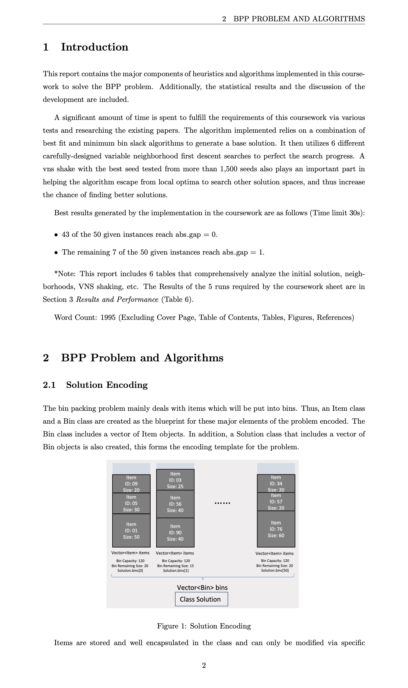
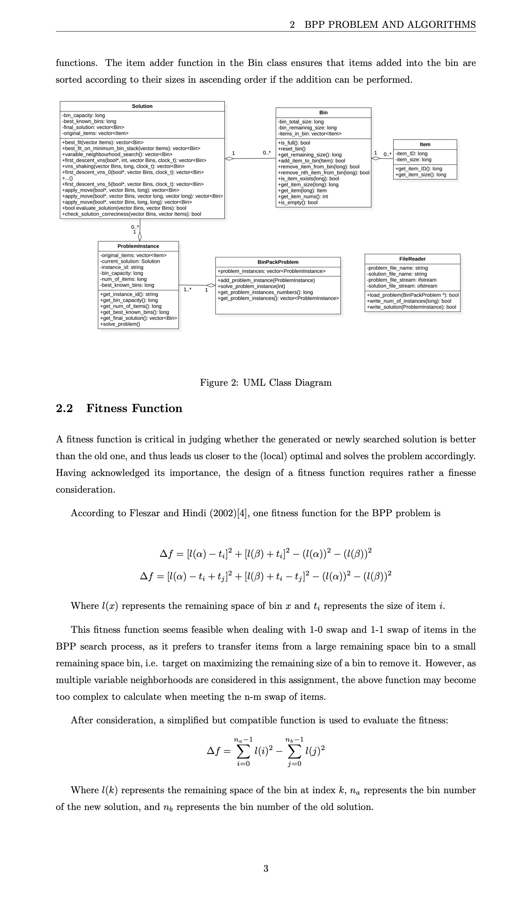
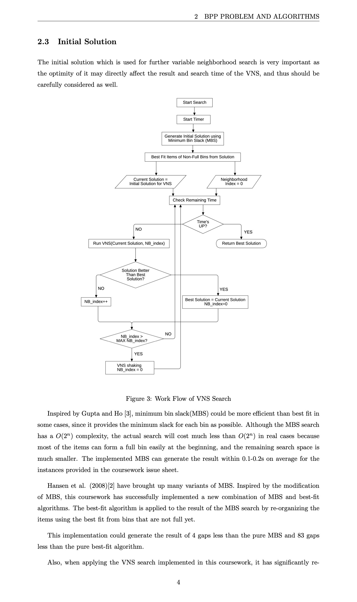
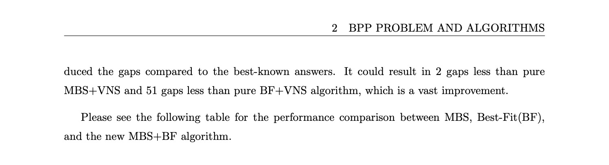
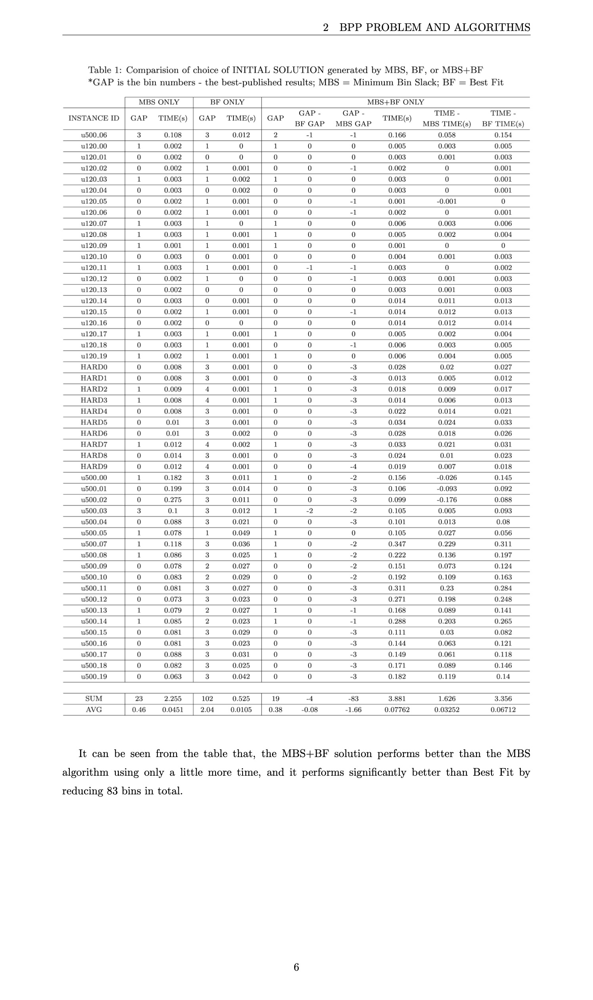
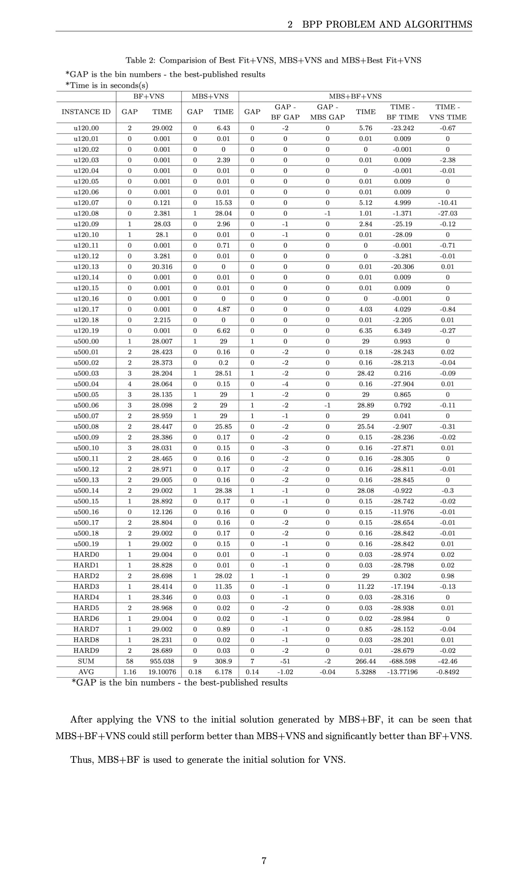
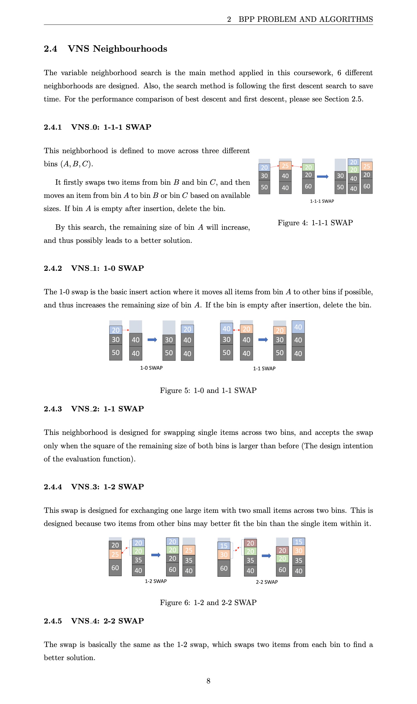
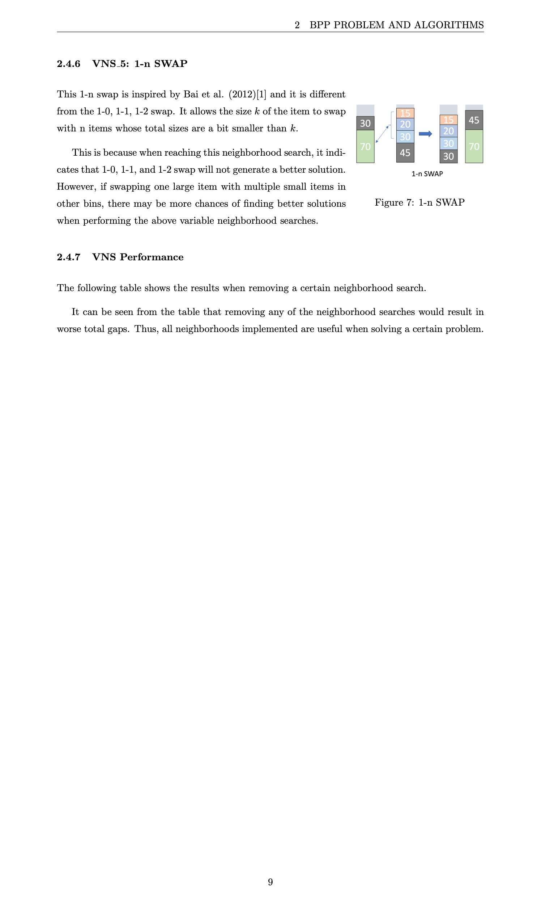
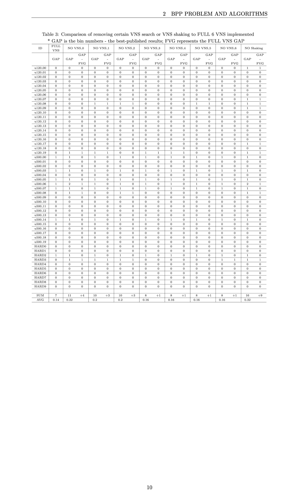
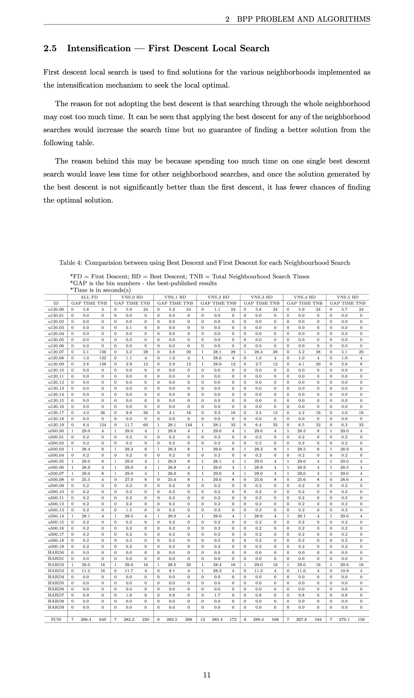
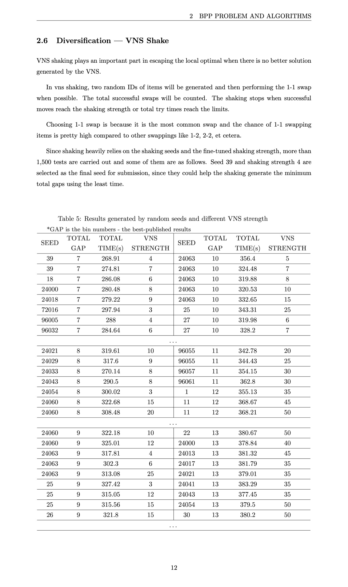
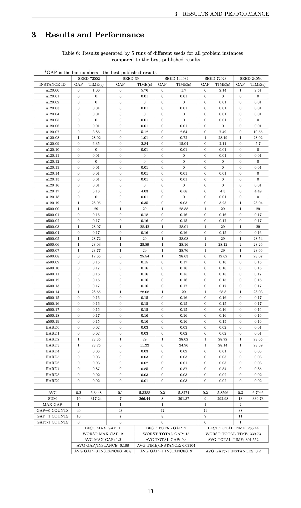
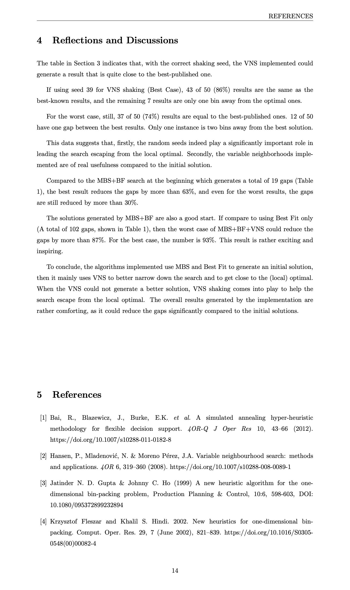
